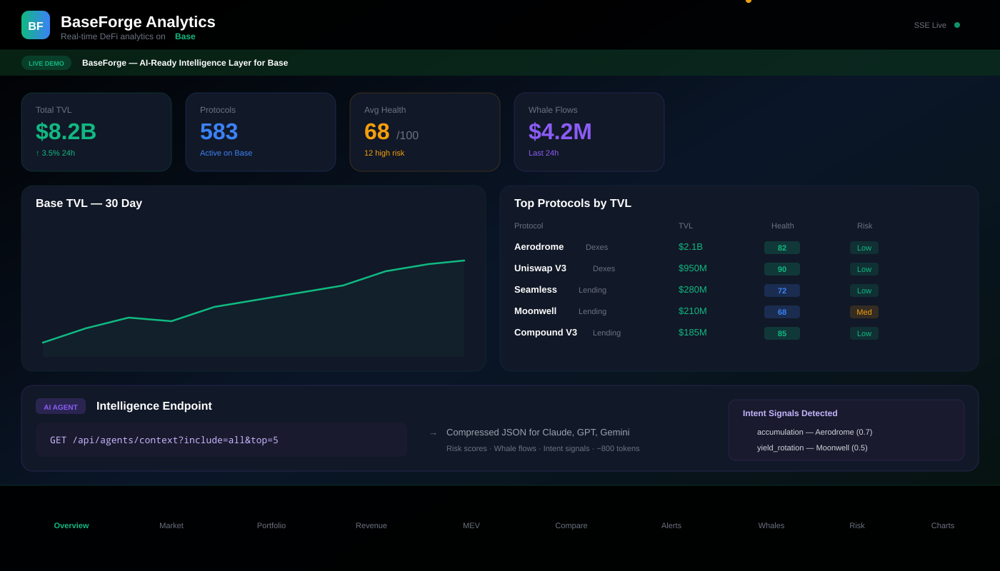

# BaseForge

> The AI-Ready Intelligence Layer for the Base Ecosystem.

<p align="center">
  <a href="https://baseforge-v1.vercel.app"></a>
  <a href="https://baseforge-v1.vercel.app/api/agents/context?include=all&top=5"></a>
  <a href="https://vercel.com/new/clone?repository-url=https%3A%2F%2Fgithub.com%2FAmnAnon%2Fbaseforge-v1&env=ETHERSCAN_API_KEY,DATABASE_URL,ENVIO_API_TOKEN&envDescription=See%20.env.example%20for%20all%20variables&project-name=baseforge"></a>
</p>

<p align="center">
  <a href="https://github.com/AmnAnon/baseforge-v1/actions/workflows/ci.yml"></a>
  <a href="https://github.com/AmnAnon/baseforge-v1/blob/main/LICENSE"></a>
  <a href="https://github.com/AmnAnon/baseforge-v1/blob/main/SECURITY.md"></a>
  <a href="https://app.dependabot.com/repositories/AmnAnon/baseforge-v1"></a>
  <a href="https://vercel.com?utm_source=baseforge"></a>
</p>

BaseForge ingests real-time on-chain data — TVL, risk signals, whale flows, MEV activity, gas costs, protocol revenue — and compresses it into structured intelligence feeds designed for human traders **and** AI agents. Instead of raw dashboards, BaseForge delivers actionable signal: compressed market state, risk-weighted protocol health, and machine-readable context payloads that LLMs can consume directly.

### Dashboard — Cyber-Neon Theme

<p align="center">
  
</p>

**New in v1.0:** Full UI redesign with glassmorphic cards, animated grid background, live TVL/gas ticker, radial risk rings, and count-up number animations. CRT scanline toggle (`Ctrl+Shift+S`) for power users.

### Live Dashboard Screenshots

<table>
  <tr>
    <td><strong>Overview + Live Ticker</strong></td>
    <td><strong>Risk Scores + Radial Rings</strong></td>
  </tr>
  <tr>
    <td>
      <em>Header with real-time TVL, protocol count, 24h change, and gas price — all with Framer Motion count-up animations and neon glow effects.</em>
    </td>
    <td>
      <em>SVG radial progress rings with color-coded glow (green/yellow/red) showing protocol health at a glance.</em>
    </td>
  </tr>
  <tr>
    <td><strong>AI Agent Context</strong></td>
    <td><strong>Whale Tracker</strong></td>
  </tr>
  <tr>
    <td>
      <em>Compressed ecosystem state JSON — single API call for full Base DeFi intelligence.</em>
    </td>
    <td>
      <em>Real-time on-chain flows across Aerodrome, Uniswap V3, Seamless, and Moonwell.</em>
    </td>
  </tr>
</table>

### Live Demo

| Demo | URL |
|---|---|
| **Full Dashboard** | [baseforge-v1.vercel.app](https://baseforge-v1.vercel.app) |
| **Agent API** | [/api/agents/context?include=all&top=5](https://baseforge-v1.vercel.app/api/agents/context?include=all&top=5) |
| **Prometheus Metrics** | [/api/metrics](https://baseforge-v1.vercel.app/api/metrics) |
| **Health Check** | [/api/health](https://baseforge-v1.vercel.app/api/health) |
| **OpenAPI Spec** | [/openapi.json](https://baseforge-v1.vercel.app/openapi.json) |

### AI Agent API — One call, entire ecosystem state

```bash
curl https://baseforge.vercel.app/api/agents/context?include=all&top=5 | jq
```

```jsonc
{
  "_v": "2.0",
  "_chain": "base",
  "_source": "envio-hypersync",
  "market": { "totalTvl": 8200000000, "protocols": 340, "avgHealth": 68 },
  "protocols": [
    { "id": "aerodrome", "tvl": 2100000000, "health": 82, "level": "low" },
    { "id": "uniswap-v3", "tvl": 950000000, "health": 90, "level": "low" }
  ],
  "risk": { "highRiskCount": 12, "concentration": { "hhi": 980, "level": "MEDIUM" } },
  "intents": [
    { "signal": "accumulation", "protocol": "aerodrome", "confidence": 0.7 }
  ]
}
```

> See [`docs/AGENT_GUIDE.md`](docs/AGENT_GUIDE.md) for full integration guide with prompt templates.

## Killer Use Cases

1. **Automated Risk Assessment** — Real-time health scoring across every Base protocol, factoring in audit status, TVL concentration, fork lineage, oracle diversity, and 7d flow volatility. Get a single number that tells you whether a protocol is safe to interact with before you sign.

2. **AI Agent Data Ingestion** — Plug your agent into `/api/agents/context` and get the entire Base ecosystem state as a single, compressed JSON payload — market overview, risk scores, protocol rankings, and anomaly signals — token-efficient and purpose-built for LLM context windows (Claude, Gemini, local models).

3. **Whale Tracking & Intent Detection** — Monitor large transactions across Uniswap V3, Aerodrome, and Seamless on Base. Surface whale movements before they impact your positions, with historical flow patterns that reveal accumulation and distribution signatures.

## Features

| Module | Description |
|---|---|
| **Overview** | Top 20 Base protocols by TVL, aggregate metrics, and time-series charts |
| **Protocol Health** | Risk scoring with audit status, smart-contract maturity, dependency depth, and TVL-weighted health |
| **Market Data** | Live prices, market caps, 24h volume, APY trends across Base protocols |
| **Whale Tracker** | Large transactions across Uniswap V3, Aerodrome, and Seamless on Base |
| **MEV Monitor** | Sandwiches, arbitrage, and liquidations with estimated USD extracted |
| **Gas Tracker** | Real-time Base gas prices with historical trends and L1 vs L2 cost breakdown |
| **Revenue Dashboard** | Protocol-level fees, revenue, and treasury tracking |
| **Alerts** | Threshold-based notifications for TVL drops, risk score changes, and whale activity |
| **Portfolio** | Connect wallet to track positions, PnL, and protocol allocations |
| **Base Network** | L1 vs L2 TVL, chain growth, bridging volume |
| **Moonwell** | Comet lending markets: USDC, WETH, cbETH, COMP |
| **API Key Auth** | Per-consumer rate limiting (free/pro/enterprise) with usage tracking |
| **Prometheus** | `/api/metrics` endpoint with uptime, cache, circuit breaker stats |
| **OpenAPI** | Full OpenAPI 3.1 spec at `/openapi.json` |

## What's New in v1.0.0-beta.1

| Area | Change |
|---|---|
| 🎨 **UI** | Cyber-neon theme, glassmorphic cards, live ticker, count-up animations, radial risk rings, CRT scanline toggle |
| 🔑 **Auth** | API key system with SHA-256 hashed keys, tiered rate limits, admin CRUD |
| 🛡️ **Resilience** | Circuit breaker (CLOSED→OPEN→HALF_OPEN), exponential backoff + jitter retry, Redis enforcement in prod |
| 📡 **Indexing** | Moonwell Comet markets added, deeper Aerodrome coverage |
| 🧪 **Testing** | 21 test files, 178 tests, 62%+ coverage, MSW mock infrastructure |
| 📊 **Observability** | Prometheus metrics, Sentry transaction tracing, circuit breaker health reporting |
| 🔧 **CI/CD** | 6-job pipeline: lint, typecheck, test, build, audit, docker |
| 📝 **Docs** | OpenAPI spec, TypeScript/Python client types, SECURITY.md, retention policy |

## Architecture

```
src/
├── app/
│   ├── page.tsx                  # Main dashboard — SSE streaming + poll-fallback
│   ├── api/
│   │   ├── analytics/            # Top protocols, TVL history, aggregate metrics
│   │   ├── risk-history/         # Time-series risk scores
│   │   ├── whales/               # Whale flow detection (Envio → Etherscan fallback)
│   │   ├── swaps/                # DEX swap events (Aerodrome, Uniswap V3)
│   │   ├── lending/              # Lending events (Seamless deposits/borrows/liquidations)
│   │   ├── mev/                  # MEV event monitoring
│   │   ├── gas/                  # Gas price tracking
│   │   ├── revenue/              # Protocol revenue aggregation
│   │   ├── market/               # Market data (prices, APY, volume)
│   │   ├── alerts/               # Alert evaluation engine
│   │   ├── portfolio/            # Wallet position tracking
│   │   ├── protocol-aggregator/  # Risk-scoring engine (enriched by indexer)
│   │   ├── agents/context/       # Compressed LLM context endpoint
│   │   ├── stream/               # SSE streaming gateway
│   │   └── health/               # Health check with indexer status
├── lib/
│   ├── cache.ts                  # Unified cache — in-memory + optional Upstash Redis
│   ├── validation.ts             # Zod-based response validation helpers
│   ├── protocol-aggregator.ts    # Cross-source risk scoring (DefiLlama + indexer)
│   ├── logger.ts                 # Structured logging
│   ├── rate-limit.ts             # API rate limiting
│   ├── data/
│   │   └── indexers/             # ⭐ On-chain data indexer layer
│   │       ├── index.ts          # Unified service — orchestrates providers + cache
│   │       ├── types.ts          # Normalized TypeScript types
│   │       ├── schemas.ts        # Zod schemas for all indexer data
│   │       ├── contracts.ts      # Base chain addresses + event signatures
│   │       ├── envio-provider.ts # Primary: Envio HyperSync (2000x faster than RPC)
│   │       └── fallback-provider.ts  # Secondary: Etherscan V2 + DefiLlama
│   └── db/                       # Drizzle ORM + Neon Postgres schema + client
├── components/
│   ├── sections/                 # Dashboard sections (Overview, Risk, Whales, MEV, etc.)
│   ├── ui/                       # Reusable UI primitives (cards, switches, tables)
│   └── charts/                   # Tremor-based charts (TVL, risk scores)
├── middleware.ts                 # Edge middleware — CORS for agent API
└── instrumentation.ts            # Node.js instrumentation for monitoring
```

## Getting Started

```bash
npm install
cp .env.example .env.local    # configure API keys and DB URL
npm run dev
```

Open [http://localhost:3000](http://localhost:3000).

### Required Environment Variables

| Variable | Description |
|---|---|
| `ENVIO_API_TOKEN` | Envio HyperSync API token — primary on-chain data source (get from envio.dev) |
| `ETHERSCAN_API_KEY` | Etherscan V2 API key — fallback for whale tracking |
| `DATABASE_URL` | Neon Postgres connection string for risk history and alerts |
| `UPSTASH_REDIS_URL` | Optional — Upstash Redis endpoint for distributed cache |
| `UPSTASH_REDIS_TOKEN` | Optional — Upstash Redis token |
| `CACHE_BACKEND` | `memory` (default) or `upstash` |

## Scripts

```bash
npm run dev          # Dev server with Turbopack
npm run build        # Production build
npm run build:analyze # Build with bundle-size analysis
npm run test         # Run Vitest suite
npm run test:watch   # Vitest in watch mode
npm run lint         # ESLint
npm run db:generate  # Generate Drizzle migrations
npm run db:push      # Push schema to DB
npm run db:studio    # Open Drizzle Studio
```

## Tech Stack

- **Framework:** Next.js 15.5 (App Router, Turbopack)
- **UI:** React 19, Tailwind CSS 4, Tremor v4, Framer Motion, Lucide icons
- **Data:** DefiLlama API, Llama API, Etherscan V2, CoinGecko, Llama Yields
- **Cache:** In-memory with Upstash Redis option
- **Database:** Neon Postgres with Drizzle ORM
- **Observability:** Sentry, pino structured logging
- **Testing:** Vitest + happy-dom

## Production Roadmap

Remaining items to get BaseForge to a production-ready v1.0:

### Phase 1 — Real-time Data Pipeline (High Priority)
- [x] **Dynamic OG images** — Pull live TVL from DefiLlama with timeout-based fetch and caching
- [x] **Per-protocol detail pages** — Route `/protocols/[slug]` with TVL chart, risk score, yields, and whale activity
- [x] **SSE reconnection resilience** — Exponential backoff and state recovery via `/api/stream`
- [x] **Data validation layer** — Zod schemas applied to all API route responses

### Phase 2 — Farcaster Frame Enhancements (Medium Priority)
- [x] **Frame V2 metadata** — Dynamic OG images, V2 spec compliance via `/api/frame`
- [x] **Protocol-specific frames** — Dynamic OG images with TVL, Health Score, and APY per protocol
- [x] **Frame miniapp** — Full Farcaster Mini App with `.well-known/farcaster.json` manifest, `fc:frame:app_url`, and `action: "app"` launch
- [x] **Frame analytics** — Interaction logging to Postgres with `Promise.race()` timeout, capturing fid, button clicks, cast source, and wallet
- [x] **Frame analytics queries** — Dashboard endpoint for click-through rates, top protocols by frame traffic, and button popularity

### Phase 3 — Data Quality & Reliability (High Priority)
- [x] **Fallback data strategy** — Stale cached data with staleness indicator on all API routes
- [x] **Rate limiting** — In-memory rate limiting middleware applied to API routes
- [x] **Error boundaries** — React error boundaries wrapped on major sections
- [x] **Health check endpoint** — `/api/health` returning system status

### Phase 4 — Security & Infrastructure (High Priority)
- [x] **Environment variable audit** — Documented in `.env.example`, defaults in code
- [x] **Input sanitization** — Zod validation on API routes, query param guards
- [x] **Sentry integration** — Initialized via `instrumentation.ts`, verified with test hook
- [x] **CI/CD pipeline** — GitHub Actions: lint + typecheck + test + build on PR
- [x] **Docker support** — Dockerfile for self-hosted deployment

### Phase 5 — Polish & UX (Medium Priority)
- [x] **Loading skeletons** — Replace inline loading spinners with skeleton placeholders per section
- [x] **Mobile responsive audit** — Test all 10 dashboard sections on narrow viewports
- [x] **Protocol compare** — Wire up the compare section with real multi-protocol TVL comparison
- [x] **Alert engine** — Connected alert rules to Postgres with cooldown, acknowledge, and CRUD API
- [x] **Portfolio tracking** — Viem-based wallet balance tracking with Ethereum + 6 ERC20 tokens on Base via multicall

### Phase 6 — Testing (Low Priority)
- [x] **API route tests** — Mock DefiLlama/external responses, stale cache fallback, error cases, category filtering
- [x] **Hook tests** — `useRealTimeData` SSE connection lifecycle, reconnection with exponential backoff, disconnect cleanup
- [x] **Component tests** — Snapshot key sections with mocked data
- [x] **E2E smoke tests** — Route accessibility checks for `/`, `/api/frame`, `/api/stream`, `/api/analytics`, `/api/health`

---

## Current Progress — Q2 2026: Intelligence Layer Pivot

### Where we started
After completing all 6 phases of the technical roadmap, BaseForge had a solid foundation but faced three critiques: no clear value proposition beyond "dashboard", no obvious killer use case, and no ecosystem layer for developers or agents.

### What we changed
- **Pivoted positioning** from "DeFi analytics dashboard" → **"The AI-Ready Intelligence Layer for the Base Ecosystem"**
- **Added `/api/agents/context`** — compressed, token-efficient JSON endpoint for LLM ingestion (v2: filterable, intent signals, confidence scores)
- **Added `/api/agents/examples`** — interactive API reference with prompt templates and example payloads
- **Added `/api/protocols`** — bulk protocol listing endpoint (was missing root route)
- **Added `/api/swaps`** — real-time DEX swap events via Envio HyperSync
- **Added `/api/lending`** — lending protocol events (deposits, borrows, liquidations)

### What's working now
- Farcaster Frame v3 with miniapp support (8/8 tests passing)
- Risk scoring across 580+ Base protocols with on-chain data enrichment (swap volume, net flows, trader count)
- SSE streaming with exponential backoff and stale fallback
- Envio HyperSync primary indexer with Etherscan V2 fallback
- Agent context endpoint v2 with query params, intent detection, and Zod validation
- 93 tests passing, zero TypeScript errors

### Next: The Agent Vision
- **Agent SDK wrapper** — TypeScript/Python client for `/api/agents/context` (see `docs/AGENT_GUIDE.md` for usage)
- **~~Intent detection~~** ✅ Implemented — accumulation/distribution/yield rotation/risk escalation signals
- **Predictive risk model** — time-series-based risk projection, not just point-in-time scoring
- **CLI/Developer platform** — `baseforge init`, templates for agents, bots, nodes

### Known Issues
- ~~**Rate limiter dev-mode bypass** — Fixed: now uses `NODE_ENV !== "production"`.~~
- ~~**Farcaster Frame root-level meta tags** — Fixed: `layout.tsx` now uses `v3`.~~

## Data Architecture

### Why Envio HyperSync?

After evaluating Goldsky, Envio HyperIndex, Subsquid, and The Graph for Base chain indexing in 2026, we chose **Envio HyperSync** as the primary data source:

| Criteria | Envio HyperSync | Goldsky | Subsquid | The Graph |
|---|---|---|---|---|
| **Speed** | 2000x faster than RPC, 25K events/sec | Fast (Turbo Pipelines) | 100-1000x faster | Standard |
| **Benchmark (May 2025)** | 15x faster than Subsquid, 142x faster than Graph | N/A | 2nd place | 142x slower |
| **Real-time latency** | Sub-second | Sub-second | Near real-time | Seconds |
| **Base support** | Native (base.hypersync.xyz) | Native | Yes | Yes |
| **Self-hosted option** | No (SaaS) | No (SaaS) | Yes (decentralized) | Yes (decentralized) |
| **TypeScript SDK** | First-class, Rust core | CLI-focused | SDK available | GraphQL |
| **Cost model** | API token (free tier) | Paid tiers | Token-based | GRT staking |
| **Maintenance** | Zero — no subgraph deployment | Subgraph deploy | Squid deploy | Subgraph deploy |

**Decision:** Envio wins on raw speed, zero-maintenance (no subgraph to deploy/maintain), and TypeScript-first SDK. The Rust-based HyperSync engine eliminates the RPC bottleneck entirely — we query event logs directly from their optimized data layer.

### Data Flow

```
┌─────────────────────────────────────────────────────────────────┐
│                        API Routes                            │
│  /api/whales  /api/swaps  /api/lending  /api/risk             │
└───────────────────┬─────────────────────────────────────────────┘
                    │
         ┌─────────┴─────────┐
         │  Indexer Service  │   lib/data/indexers/index.ts
         │  (cache + routing) │   Time-based cache (30s-2min)
         └────┬──────────┬────┘   Circuit breaker pattern
              │          │
     ┌───────┴──────┐ ┌─┴─────────────┐
     │   PRIMARY   │ │   FALLBACK    │
     │ Envio Hyper │ │ Etherscan V2  │
     │   Sync      │ │ + DefiLlama   │
     └───────┬──────┘ └──────┬────────┘
             │              │
    Event-level logs    TX-level data
   (swaps, borrows,    (value transfers
    liquidations)        only)
```

**Fallback strategy:**
1. Check in-memory/Redis cache first (fastest)
2. Query Envio HyperSync (event-level granularity, ~25K events/sec)
3. If Envio fails → circuit breaker activates → fall back to Etherscan V2
4. Health check every 60s re-enables Envio when it recovers

### What the Indexer Provides vs. Before

| Metric | Before (Etherscan only) | Now (Envio + fallback) |
|---|---|---|
| Swap detection | Value transfers only | Decoded swap events with amounts |
| Protocols covered | 3 address watches | Aerodrome + Uniswap V3 + Seamless |
| Lending activity | None | Deposits, borrows, repays, liquidations |
| Whale classification | "swap" or "transfer" | swap / deposit / withdraw / borrow / repay / liquidation |
| Risk scoring inputs | TVL + audit count | + swap volume, trader count, net flows, outflow ratio |
| Latency | 5-10s (Etherscan rate limits) | <1s (HyperSync) |
| Update frequency | 60s polling | 30s with stale fallback |

### New API Endpoints

| Endpoint | Description |
|---|---|
| `GET /api/swaps?protocol=aerodrome&min=1000&limit=50` | Recent swap events with USD values |
| `GET /api/lending?action=liquidation&min=10000` | Lending protocol events (Seamless) |
| `GET /api/whales?min=50000` | Whale flows (now enriched with event-level data) |
| `GET /api/health` | Includes indexer primary/fallback status |

All endpoints return an `X-Data-Source` header indicating which provider served the data (`envio-hypersync` or `etherscan-fallback`).

## Open Source

BaseForge is open source. Contributions welcome — see the roadmap above for areas that need work.
