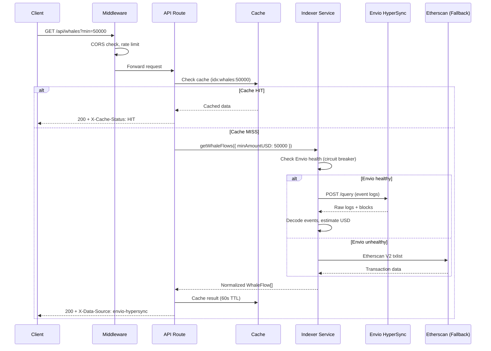

# Architecture

## System Overview

BaseForge is a Next.js 16 application that aggregates on-chain and off-chain data about the Base blockchain ecosystem, computes risk scores, and serves the result as both a human dashboard and a machine-readable API for AI agents.

```
┌─────────────────────────────────────────────────────────────┐
│                     Client Layer                            │
│                                                             │
│  ┌──────────┐  ┌──────────┐  ┌──────────────────────────┐  │
│  │ Dashboard │  │ Farcaster│  │ AI Agents (Claude, GPT)  │  │
│  │   (SPA)  │  │  Frame   │  │ /api/agents/context      │  │
│  └────┬─────┘  └────┬─────┘  └────────────┬─────────────┘  │
│       │SSE+REST     │POST                  │REST            │
└───────┼─────────────┼──────────────────────┼────────────────┘
        │             │                      │
┌───────▼─────────────▼──────────────────────▼────────────────┐
│                   Next.js App Router                        │
│                                                             │
│  ┌─────────┐ ┌──────────┐ ┌──────────┐ ┌───────────────┐   │
│  │  Edge   │ │  Server  │ │   SSE    │ │   Middleware   │   │
│  │Middleware│ │  Routes  │ │ Stream   │ │ (CORS, auth)  │   │
│  │(CORS)   │ │ (30+)    │ │ Gateway  │ │               │   │
│  └─────────┘ └────┬─────┘ └────┬─────┘ └───────────────┘   │
│                   │            │                            │
│  ┌────────────────▼────────────▼───────────────────────┐    │
│  │             Service Layer                           │    │
│  │                                                     │    │
│  │  ┌──────────────┐  ┌─────────┐  ┌───────────────┐  │    │
│  │  │  Protocol    │  │  Cache  │  │   Indexer     │  │    │
│  │  │  Aggregator  │  │ (mem/   │  │   Service     │  │    │
│  │  │  (risk +     │  │  Redis) │  │  (fallback)   │  │    │
│  │  │   scoring)   │  │         │  │               │  │    │
│  │  └──────┬───────┘  └────┬────┘  └───────┬───────┘  │    │
│  └─────────┼───────────────┼───────────────┼──────────┘    │
│            │               │               │               │
└────────────┼───────────────┼───────────────┼───────────────┘
             │               │               │
┌────────────▼───────────────▼───────────────▼───────────────┐
│                    Data Layer                               │
│                                                             │
│  ┌──────────────┐ ┌───────────┐ ┌────────────────────────┐ │
│  │  DefiLlama   │ │ CoinGecko │ │ Envio HyperSync        │ │
│  │  API         │ │ API       │ │ (primary indexer)      │ │
│  │  - protocols │ │ - prices  │ │ - swap events          │ │
│  │  - TVL       │ │ - mcap    │ │ - whale flows          │ │
│  │  - yields    │ │ - volume  │ │ - lending events       │ │
│  │  - fees      │ │           │ │                        │ │
│  └──────────────┘ └───────────┘ └────────────────────────┘ │
│                                                             │
│  ┌──────────────┐ ┌───────────┐ ┌────────────────────────┐ │
│  │  Etherscan   │ │ Neon      │ │ Upstash Redis          │ │
│  │  V2 API      │ │ Postgres  │ │ (optional cache)       │ │
│  │  (fallback)  │ │ (alerts,  │ │                        │ │
│  │              │ │  frames)  │ │                        │ │
│  └──────────────┘ └───────────┘ └────────────────────────┘ │
└─────────────────────────────────────────────────────────────┘
```

## Request Flow



## Directory Structure

```
baseforge/
├── docs/                        # Documentation (you are here)
├── public/                      # Static assets (icons, preview, splash)
├── src/
│   ├── app/
│   │   ├── page.tsx             # Main dashboard (client-side SPA)
│   │   ├── layout.tsx           # Root layout with demo banner
│   │   ├── globals.css          # Tailwind entry point
│   │   ├── protocols/[slug]/    # Per-protocol detail pages
│   │   ├── services/            # Data fetching services
│   │   ├── types/               # Shared TypeScript types
│   │   └── api/                 # 30+ API routes (see API.md)
│   │       ├── agents/          # AI agent endpoints
│   │       │   ├── context/     # Main agent context (v2)
│   │       │   └── examples/    # Interactive API reference
│   │       ├── analytics/       # Dashboard overview data
│   │       ├── alerts/          # Alert engine + CRUD
│   │       ├── frame/           # Farcaster Frame handler
│   │       ├── health/          # System health check
│   │       ├── lending/         # Lending events (Seamless)
│   │       ├── og/              # Dynamic OG images (edge)
│   │       ├── protocols/       # Protocol list + detail
│   │       ├── risk/            # Risk scoring engine
│   │       ├── stream/          # SSE streaming gateway
│   │       ├── swaps/           # DEX swap events
│   │       └── whales/          # Whale flow tracker
│   ├── components/
│   │   ├── sections/            # 10 dashboard tab sections
│   │   ├── charts/              # Tremor chart components
│   │   ├── ui/                  # Primitives (Card, Skeleton, etc.)
│   │   ├── DemoBanner.tsx       # Live demo banner
│   │   ├── ErrorBoundary.tsx    # Section-level error isolation
│   │   └── AdminStatsBar.tsx    # Frame analytics bar
│   ├── hooks/
│   │   └── useRealTimeData.ts   # SSE hook with exponential backoff
│   ├── lib/
│   │   ├── cache.ts             # Cache abstraction (memory + Upstash)
│   │   ├── logger.ts            # Structured logging (pino-style)
│   │   ├── rate-limit.ts        # In-memory sliding window
│   │   ├── validation.ts        # Zod validation helpers
│   │   ├── protocol-aggregator.ts  # Risk scoring + data merging
│   │   ├── data/
│   │   │   └── indexers/        # On-chain indexer layer
│   │   │       ├── index.ts     # Unified service (cache + fallback)
│   │   │       ├── envio-provider.ts   # Envio HyperSync client
│   │   │       ├── fallback-provider.ts # Etherscan V2 fallback
│   │   │       ├── contracts.ts  # Addresses + event signatures
│   │   │       ├── types.ts      # Normalized event types
│   │   │       └── schemas.ts    # Zod schemas for indexer data
│   │   ├── db/
│   │   │   ├── client.ts        # Drizzle ORM (lazy-init)
│   │   │   ├── schema.ts        # Postgres tables
│   │   │   └── frame-analytics.ts # Frame interaction logging
│   │   ├── viem/
│   │   │   ├── client.ts        # Base chain viem client
│   │   │   └── balances.ts      # Multicall wallet balances
│   │   └── zod/
│   │       └── schemas.ts       # API response Zod schemas
│   └── middleware.ts            # Edge middleware (CORS)
├── .github/workflows/ci.yml    # CI: lint + typecheck + test + build
├── Dockerfile                   # Multi-stage production build
├── drizzle.config.ts           # Drizzle ORM config
├── next.config.ts              # Next.js config (CSP, headers, images)
├── vitest.config.ts            # Test config
└── instrumentation.ts          # Sentry server-side init
```

## Key Design Decisions

### 1. Cache-First Architecture
Every API route checks cache before hitting external APIs. Cache TTLs range from 30 seconds (swaps) to 10 minutes (risk analysis). Stale fallback returns expired data with an `isStale: true` flag when upstream APIs fail.

### 2. Provider Fallback with Circuit Breaker
The indexer service uses a circuit breaker pattern: if Envio HyperSync fails, it marks the provider unhealthy and routes to the Etherscan V2 fallback. Health is re-checked every 60 seconds.

### 3. Lazy Database Client
The Drizzle ORM client is initialized via a `Proxy` on first access, not at import time. Routes that don't need Postgres (most of them) never trigger a connection.

### 4. Edge Middleware for CORS
Agent API routes (`/api/agents/*`) need cross-origin access for browser-based LLM tools. The middleware handles CORS preflight and response headers without touching other routes.

### 5. SSE with Serverless Limits
The `/api/stream` route caps connections at 5 minutes and respects `AbortSignal` for client disconnect. This works on Vercel's serverless functions without leaking resources.

### 6. Standalone Docker Output
`next.config.ts` uses `output: "standalone"` which produces a minimal `server.js` + `.next/static` bundle. The Dockerfile uses multi-stage builds with a non-root `nextjs` user.
