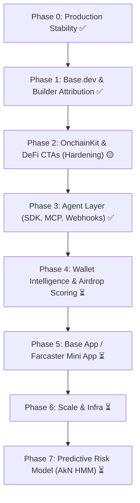

# BaseForge v2 Roadmap & Execution Plan

Phased execution plan for BaseForge v1 → v2+. Checkboxes track live implementation and verified production status.

**Stack Reality:** Next.js 16 on Vercel, Neon Postgres cache & rate limits (`backend=postgres`), Envio HyperSync primary indexer, Etherscan fallback, Vercel Cron (`/api/cron/warm`), Official Python SDK (`baseforge`), Model Context Protocol (`@baseforge/mcp`).

---

## 🗺️ Roadmap Phases Overview



---

## Phase 0 — Production Stability & Health Verification ✅

**Goal:** Vercel serves latest `main`, env matches `src/lib/env-config.ts`, `/api/health` returns `100% OK`.

| Step | Status | Notes |
|------|--------|-------|
| Redeploy Vercel **Production** from latest `main` | **Done** | Deployed at `https://baseforge-v1.vercel.app` |
| `DATABASE_URL` set (Neon Postgres) | **Done** | `checks.database.status: ok` (latency ~700ms) |
| `ENVIO_API_TOKEN` & `ETHERSCAN_API_KEY` set | **Done** | Primary HyperSync active on Base @ block 50M+ |
| `CACHE_BACKEND` set to `postgres` | **Done** | Shared PostgreSQL key-value caching active |
| `WORKER_URL` & Background cron | **Done** | Fallback to Vercel Cron `/api/cron/warm` every 2m |
| Health check passes cleanly | **Done** | `GET /api/health` returns `status: "ok"` |

### Verified Live Health Check

```json
{
  "status": "ok",
  "checks": {
    "defillama": { "status": "ok", "latency": 74 },
    "coingecko": { "status": "ok", "latency": 56 },
    "cache": { "status": "ok", "detail": "backend=postgres, size=0, hitRate=0.0%" },
    "database": { "status": "ok", "latency": 768 },
    "indexer_primary": { "status": "ok", "latency": 86, "detail": "envio-hypersync block=50208257 lag=0" },
    "indexer_fallback": { "status": "ok", "latency": 121, "detail": "etherscan-fallback block=15" },
    "indexer_active": { "status": "ok", "detail": "active_provider=envio-hypersync" },
    "worker": { "status": "ok", "detail": "vercel-cron (/api/cron/warm every 2m)" }
  }
}
```

---

## Phase 1 — Base.dev & Builder Code Attribution ✅

- [x] Register / verify app on [Base.dev](https://base.dev)
- [x] Builder code env + `dataSuffix` in wagmi config (`NEXT_PUBLIC_BASE_BUILDER_CODE`)
- [x] ERC-8021 via `src/lib/builder-code.ts` (attribution on outbound txs)
- [ ] Grants narrative + application submission

---

## Phase 2 — OnchainKit & DeFi CTAs (Human Layer) 🟡

**Goal:** Harden human-facing DeFi execution since it's the first touchpoint before agent API consumers.

- [x] OnchainKit install + `OnchainKitAppProvider` (Wagmi v2 aligned)
- [x] Swap / LP / deposit CTAs on `/protocols/[slug]` (`ProtocolActionPanel`)
- [x] Contract addresses centralized in `src/lib/contracts.ts`
- [ ] **Hardening Tasks:**
  - [ ] Robust token approvals with clear allowance status UI
  - [ ] Slippage tolerance configuration and price impact warnings
  - [ ] Dynamic gas estimation preview with fallback calldata validation

---

## Phase 3 — AI Agent Layer & Developer Tooling ✅

**Goal:** Deepen `/api/agents/context` as the primary market differentiator before expanding surface area.

- [x] **Webhook Mode (`POST /api/agents/context`)**:
  - Cryptographic HMAC-SHA256 signatures (`X-BaseForge-Signature`, `X-BaseForge-Timestamp`)
  - Server-Side Request Forgery (SSRF) DNS resolution & private IP blocking
  - Agent event filters (`min_whale_usd`, `risk_level`, `anomaly_only`)
- [x] **Official Python SDK (`baseforge`)**:
  - Typed Pydantic models with synchronous & asynchronous clients
  - Constant-time webhook verification (`BaseForgeWebhookVerifier`)
  - Drop-in tool adapters for **LangChain**, **CrewAI**, and **OpenAI / Claude Tool Calling**
  - Runnable examples: quickstart, FastAPI webhook receiver, whale copy-trade bot
- [x] **Model Context Protocol (MCP) Server (`@baseforge/mcp`)**:
  - Zero-dependency JSON-RPC 2.0 stdio transport
  - Native integration for **Claude Desktop**, **Cursor**, **Antigravity CLI**, and autonomous agents
  - Python stdio MCP module in `python -m baseforge.mcp`
- [x] **Agent Usage & RateLimit Telemetry (`GET /api/agents/stats`)**:
  - Public telemetry tracking active API keys, daily requests, status codes, and client SDK adoption

---

## Phase 4 — Wallet Intelligence & Airdrop Eligibility Scoring ⏳ (Unstarted)

**Goal:** Drive virality, natural retention, and wallet-level alpha distinct from institutional analytics.

### Airdrop Eligibility Scoring (v2.1 — High-Engagement Virality Driver)
*People obsessively check airdrop eligibility; it is the single highest-engagement viral retention mechanic.*
- [ ] **Multi-Protocol Interaction Heatmap**:
  - Scan user wallet for activity across Base native protocols (Aerodrome, Seamless, Moonwell, Uniswap V3, Friend.tech, Base Name Service).
- [ ] **Airdrop Readiness Score (0–100)**:
  - Volume tiers ($1k, $10k, $100k+), transaction count, and active weeks/months metrics.
  - Bridge history (Native Base Bridge vs third-party bridges).
  - Protocol diversity multiplier (DEX + Lending + Liquidity + Governance).
- [ ] **Sybil & Wash Trading Filter**:
  - Organic interaction detection vs scripted micro-transactions.
- [ ] **Actionable "Boost Your Score" Recommendations**:
  - Contextual CTAs directing users to under-utilized protocols on Base to maximize eligibility.

### Wallet Intelligence & Labeling (v2.0)
- [ ] Wallet behavioral clustering: Whale, Smart Money, MEV Bot, Arbitrageur, Liquidity Provider.
- [ ] Portfolio risk exposure & asset concentration breakdown.
- [ ] Whale adjacency scoring: Copy-trade signaling when a wallet mirrors high-conviction whale moves.
- **Files:** `src/app/api/wallet-labels/route.ts`, `src/app/api/portfolio/route.ts`, `src/app/api/whales/signals/route.ts`

---

## Phase 5 — Base App / Farcaster Mini App ⏳

- [ ] Interactive Farcaster Frame route + `/.well-known/farcaster.json` manifest
- [ ] Sign-In With Ethereum (SIWE) session management for embedded wallets
- [ ] Quick-share scorecard for wallet risk & airdrop score to Warpcast
- **Files:** `src/app/api/frame/route.tsx`, `public/.well-known/farcaster.json`

---

## Phase 6 — Scale & Infrastructure ⏳

- [ ] Multi-region Neon read replicas
- [ ] Expanded indexer coverage for long-tail Base tokens
- [ ] Stripe / on-chain billing for Pro/Enterprise API tiers

---

## Phase 7 — Predictive Risk Model (AkN HMM Adaptation) ⏳

**Goal:** Genuinely differentiated machine-learning risk intelligence built after Phase 0–3 stabilization.

- [ ] **Hidden Markov Model (HMM) Regime Switching**:
  - Reuses and adapts proven HMM architecture from AkN to detect market regime shifts (Low Volatility / Normal / High Stress / Liquidity Cascade).
- [ ] **Predictive Protocol Health Signals**:
  - Early-warning liquidation cascading alerts before TVL collapse occurs.
  - De-peg vulnerability and oracle latency anomaly forecasting.
- [ ] **Agent Integration**:
  - Expose predictive regime state inside `/api/agents/context` under `risk.predictiveRegime`.
