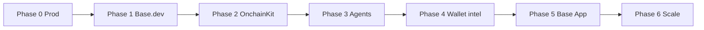

# BaseForge v2 Roadmap

Phased execution plan for BaseForge v1 → v2. Checkboxes track implementation; **Phase 0** includes a live prod verification log.

**Stack reality (April–June 2026):** Next.js 16 on Vercel, Neon Postgres cache/rate limits (no Upstash), Envio primary indexer, optional VPS worker (`docs/WORKER_VPS.md`), Vercel Cron fallback (`vercel.json` → `/api/cron/warm`).

---

## Phase 0 — Production stability

**Goal:** Vercel serves latest `main`, env matches `src/lib/env-config.ts`, `/api/health` is `ok` or `degraded` (not `unhealthy`).

| Step | Status | Notes |
|------|--------|-------|
| [ ] Redeploy Vercel **Production** from `main` @ `167db1f` or newer | Blocked | Prod still on pre–`env-config` build (see verification below) |
| [ ] `DATABASE_URL` set (Neon) | Done | `checks.database.status: ok` |
| [ ] `ENVIO_API_TOKEN`, `ETHERSCAN_API_KEY` set | Done | Indexer checks ok |
| [ ] `CACHE_BACKEND` unset or `postgres` (not `memory` / not `upstash`-only) | Fix on deploy | Latest code auto-postgres when `DATABASE_URL` present |
| [ ] `CRON_SECRET` set **or** `WORKER_URL` correct | Fix env | See worker row below |
| [ ] `WORKER_URL=http://43.163.106.68/baseforge` (no trailing slash) **or** unset `WORKER_URL` + `CRON_SECRET` | Fix env | `/baseforge/health` returns 200 from this environment |
| [ ] Remove legacy `UPSTASH_*` / `CACHE_BACKEND=memory` in Production | Recommended | See `docs/PROD_STABILIZATION.md` |
| [ ] Health curl passes | Pending redeploy | Command below |

### Verification log (2026-06-04)

```bash
curl -s https://baseforge-v1.vercel.app/api/health | jq
```

| Check | Prod (stale deploy) | Expected after redeploy + env |
|-------|---------------------|-------------------------------|
| `status` | `unhealthy` | `ok` or `degraded` |
| `checks.defillama` | HTTP 404 | `ok` (`DEFILLAMA_HEALTH_URL` → `api.llama.fi/protocols`) |
| `checks.cache` | MEMORY / upstash message | `backend=postgres` |
| `checks.database` | ok | ok |
| `checks.indexer_*` | ok | ok |
| `checks.worker` | HTTP 404 | `railway worker healthy` or `vercel-cron` |

**Root cause summary**

1. **Stale Vercel build** — Health copy and DefiLlama URL match old code; `origin/main` has `src/lib/env-config.ts` + updated `src/app/api/health/route.ts`.
2. **Worker URL** — Live probe: `curl http://43.163.106.68/baseforge/health` → `{"status":"ok",...}`. Prod `HTTP 404` implies `WORKER_URL` missing `/baseforge` suffix or pointing at a dead host.
3. **Cron path** — If you prefer cron-only: unset `WORKER_URL`, set `CRON_SECRET`, redeploy so `usesCronBackgroundJobs()` is true.

**References:** `docs/PROD_STABILIZATION.md`, `src/app/api/health/route.ts`, `src/lib/env-config.ts`, `src/app/api/cron/warm/route.ts`

---

## Phase 1 — Base.dev & builder

- [x] Register / verify app on [Base.dev](https://base.dev)
- [x] Builder code env + `dataSuffix` in wagmi config (`NEXT_PUBLIC_BASE_BUILDER_CODE`)
- [ ] Grants narrative + application assets (deferred)
- [x] ERC-8021 via `src/lib/builder-code.ts` (attribution on outbound txs when code set)
- **Files:** `docs/DEPLOYMENT.md`, wallet/connect flows, any new `src/lib/builder-code.ts`

---

## Phase 2 — OnchainKit & DeFi CTAs

- [x] OnchainKit install + `OnchainKitAppProvider` (wagmi v2 aligned)
- [x] Swap / LP / deposit CTAs on `/protocols/[slug]` (`ProtocolActionPanel`)
- [x] Contract addresses centralized in `src/lib/contracts.ts`; gaps in `docs/DATA_SOURCES.md`
- **Files:** `src/lib/contracts.ts` (or equivalent), protocol UI routes, `docs/DATA_SOURCES.md`

---

## Phase 3 — Agent narrative layer

- [ ] Richer narratives on top of `/api/agents/context`
- [ ] Intent engine hooks for agent-facing summaries
- **Files:** `src/app/api/agents/context/route.ts`, `src/app/api/agents/examples/route.ts`

---

## Phase 4 — Wallet intelligence

- [ ] v2.0: labels, portfolio context, whale adjacency
- [ ] v2.1: airdrop / eligibility scoring (stretch)
- **Files:** `src/app/api/wallet-labels/route.ts`, `src/app/api/portfolio/route.ts`, `src/app/api/whales/route.ts`

---

## Phase 5 — Base App / mini app

- [ ] Frame route + `/.well-known/farcaster.json` polish
- [ ] SIWE / session for embedded wallet
- **Files:** `src/app/api/frame/route.tsx`, `public/.well-known/farcaster.json`, `docs/DEPLOYMENT.md`

---

## Phase 6 — Scale & infra

- [ ] Unified risk pipeline (API + worker)
- [ ] Indexer coverage expansion
- [ ] API tiers / keys (`src/app/api/admin/api-keys/route.ts`)

---

## Execution order



---

## Route & file map (implementation appendix)

| Area | Routes / files |
|------|----------------|
| Health / cron | `api/health`, `api/cron/warm`, `lib/env-config.ts` |
| Agents | `api/agents/context`, `api/agents/examples` |
| Protocols / risk | `api/protocols`, `api/protocols/[slug]`, `api/risk`, `api/risk-history` |
| Market / charts | `api/base-overview`, `api/charts`, `api/market`, `api/gas` |
| Portfolio / whales | `api/portfolio`, `api/whales`, `api/wallet-labels` |
| Alerts | `api/alerts`, `api/alerts/rules` |
| Frame / OG | `api/frame`, `api/og/*` |
| Admin | `api/admin/analytics`, `api/admin/api-keys` |
| Worker (VPS) | `worker/`, `scripts/vps-deploy-worker.sh`, `docs/WORKER_VPS.md` |

---

## Next actions (pick one)

1. **Phase 0** — Vercel → Redeploy Production, fix `WORKER_URL` or enable cron, re-run health curl, tick table above.
2. **Phase 1** — Base.dev registration checklist in repo + env templates.
3. **Phase 2** — OnchainKit scaffold PR.